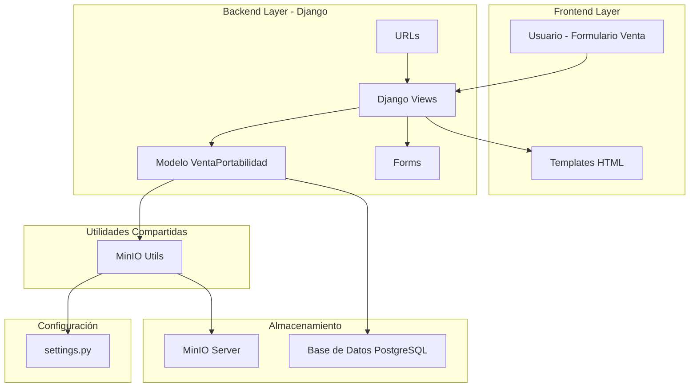
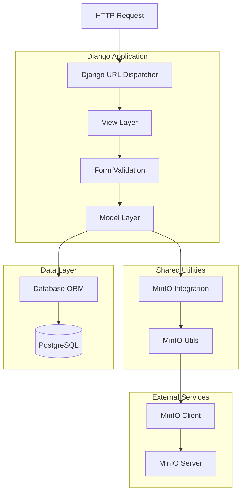
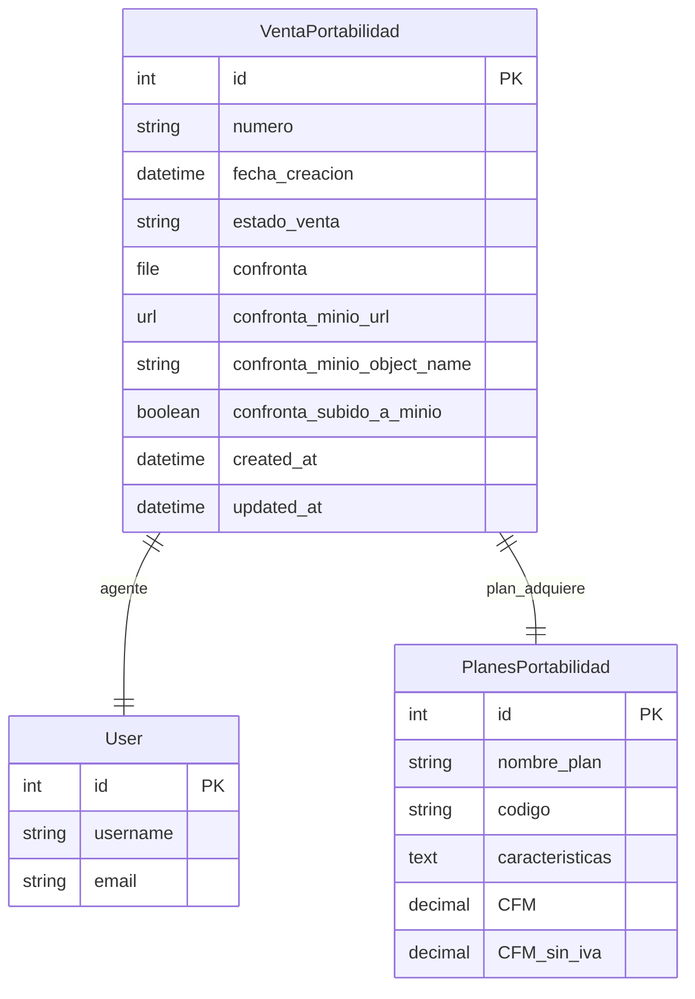
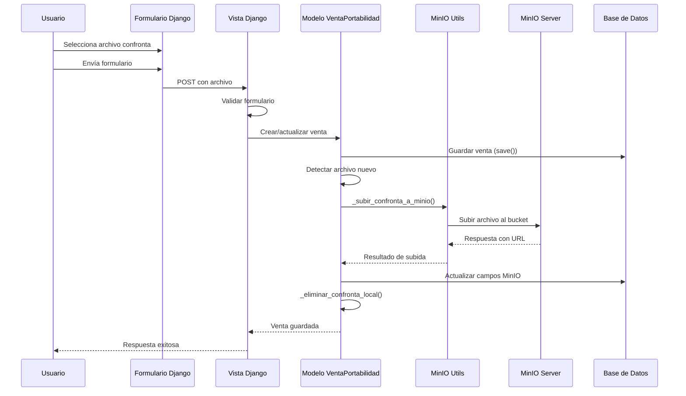
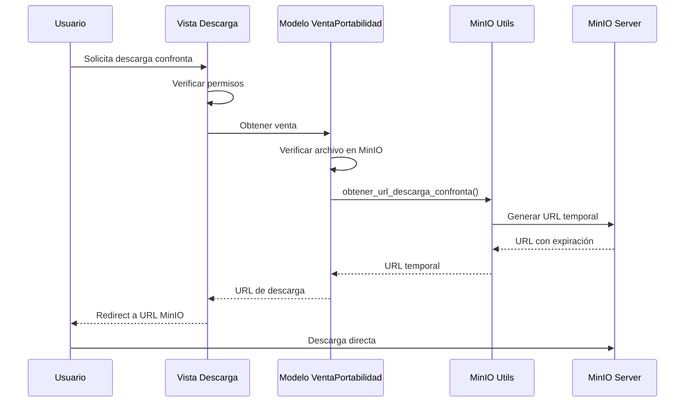

## 1. Arquitectura de Diseño



## 2. Descripción de Tecnología

- **Frontend**: Django Templates + Bootstrap + JavaScript
- **Backend**: Django 4.x + Python 3.x
- **Base de Datos**: PostgreSQL (existente)
- **Almacenamiento de Archivos**: MinIO Server
- **Utilidades**: calidad.utils.minio_utils (reutilización)
- **Configuración**: Django Settings con variables de entorno

## 3. Definiciones de Rutas

| Ruta | Propósito |
|------|----------|
| /telefonica/venta/crear-portabilidad/ | Crear nueva venta de portabilidad con upload de confronta |
| /telefonica/venta/corregir/<id>/ | Corregir venta existente, permite cambiar confronta |
| /telefonica/venta/<id>/detalle/ | Ver detalles de venta, incluye descarga de confronta |
| /telefonica/venta/<id>/descargar-confronta/ | Generar URL temporal de descarga desde MinIO |
| /telefonica/venta/<id>/resubir-confronta-minio/ | API para forzar subida a MinIO (admin) |

## 4. Definiciones de API

### 4.1 API Core

**Descarga de Confronta**
```
GET /telefonica/venta/<venta_id>/descargar-confronta/
```

Request:
| Param Name | Param Type | isRequired | Description |
|------------|------------|------------|--------------|
| venta_id | integer | true | ID de la venta de portabilidad |

Response:
- **Success**: Redirect 302 a URL temporal de MinIO
- **Error**: Redirect a página de detalle con mensaje de error

**Resubida Forzada a MinIO**
```
POST /telefonica/venta/<venta_id>/resubir-confronta-minio/
```

Request:
| Param Name | Param Type | isRequired | Description |
|------------|------------|------------|--------------|
| venta_id | integer | true | ID de la venta de portabilidad |

Response:
| Param Name | Param Type | Description |
|------------|------------|-------------|
| success | boolean | Estado de la operación |
| message | string | Mensaje descriptivo |
| url | string | URL de MinIO (si success=true) |
| error | string | Mensaje de error (si success=false) |

Example Response:
```json
{
  "success": true,
  "message": "Archivo subido exitosamente a MinIO",
  "url": "https://minio.example.com/telefonica-crea-online/confrontas/venta_PORTA-20241201120000_confronta_123"
}
```

## 5. Arquitectura del Servidor



## 6. Modelo de Datos

### 6.1 Definición del Modelo de Datos



### 6.2 Lenguaje de Definición de Datos (DDL)

**Migración para Campos MinIO**
```sql
-- Agregar campos para integración MinIO
ALTER TABLE telefonica_ventaportabilidad 
ADD COLUMN confronta_minio_url VARCHAR(2048) NULL;

ALTER TABLE telefonica_ventaportabilidad 
ADD COLUMN confronta_minio_object_name VARCHAR(500) NULL;

ALTER TABLE telefonica_ventaportabilidad 
ADD COLUMN confronta_subido_a_minio BOOLEAN DEFAULT FALSE;

-- Crear índices para optimizar consultas
CREATE INDEX idx_ventaportabilidad_minio_subido 
ON telefonica_ventaportabilidad(confronta_subido_a_minio);

CREATE INDEX idx_ventaportabilidad_minio_object 
ON telefonica_ventaportabilidad(confronta_minio_object_name) 
WHERE confronta_minio_object_name IS NOT NULL;

-- Comentarios para documentación
COMMENT ON COLUMN telefonica_ventaportabilidad.confronta_minio_url 
IS 'URL del archivo confronta almacenado en MinIO';

COMMENT ON COLUMN telefonica_ventaportabilidad.confronta_minio_object_name 
IS 'Nombre del objeto en MinIO para el archivo confronta';

COMMENT ON COLUMN telefonica_ventaportabilidad.confronta_subido_a_minio 
IS 'Indica si el archivo confronta fue subido exitosamente a MinIO';
```

**Configuración de Bucket MinIO**
```sql
-- Datos de configuración (si se almacenan en BD)
INSERT INTO configuracion_minio (bucket_name, bucket_type, descripcion, activo)
VALUES (
    'telefonica-crea-online', 
    'MINIO_BUCKET_NAME_TELEFONICA', 
    'Bucket para archivos de ventas de Telefónica', 
    TRUE
);
```

**Consultas de Monitoreo**
```sql
-- Estadísticas de migración a MinIO
SELECT 
    COUNT(*) as total_ventas,
    COUNT(CASE WHEN confronta IS NOT NULL THEN 1 END) as con_confronta_local,
    COUNT(CASE WHEN confronta_subido_a_minio = TRUE THEN 1 END) as subidos_minio,
    COUNT(CASE WHEN confronta IS NOT NULL AND confronta_subido_a_minio = FALSE THEN 1 END) as pendientes_migracion
FROM telefonica_ventaportabilidad;

-- Ventas con problemas de sincronización
SELECT id, numero, fecha_creacion, confronta, confronta_subido_a_minio
FROM telefonica_ventaportabilidad 
WHERE (confronta IS NOT NULL AND confronta_subido_a_minio = FALSE)
   OR (confronta IS NULL AND confronta_subido_a_minio = TRUE)
ORDER BY fecha_creacion DESC;
```

## 7. Flujo de Datos y Procesos

### 7.1 Flujo de Subida de Archivo



### 7.2 Flujo de Descarga de Archivo



## 8. Configuración y Variables de Entorno

### 8.1 Variables Requeridas en settings.py

```python
# Configuración MinIO existente (reutilizada)
MINIO_ENDPOINT = os.getenv('MINIO_ENDPOINT', 'localhost:9000')
MINIO_ACCESS_KEY = os.getenv('MINIO_ACCESS_KEY')
MINIO_SECRET_KEY = os.getenv('MINIO_SECRET_KEY')
MINIO_SECURE = os.getenv('MINIO_SECURE', 'False').lower() == 'true'

# Buckets específicos
MINIO_BUCKETS = {
    "MINIO_BUCKET_NAME_LLAMADAS": "llamadas-crea-online",
    "MINIO_BUCKET_NAME_TELEFONICA": "telefonica-crea-online",  # NUEVA
}

# Configuración de archivos
FILE_UPLOAD_MAX_MEMORY_SIZE = 10 * 1024 * 1024  # 10MB
DATA_UPLOAD_MAX_MEMORY_SIZE = 10 * 1024 * 1024   # 10MB
```

### 8.2 Configuración de Logging

```python
LOGGING = {
    'version': 1,
    'disable_existing_loggers': False,
    'formatters': {
        'verbose': {
            'format': '{levelname} {asctime} {module} {process:d} {thread:d} {message}',
            'style': '{',
        },
    },
    'handlers': {
        'minio_file': {
            'level': 'INFO',
            'class': 'logging.FileHandler',
            'filename': 'logs/minio_telefonica.log',
            'formatter': 'verbose',
        },
    },
    'loggers': {
        'telefonica.models': {
            'handlers': ['minio_file'],
            'level': 'INFO',
            'propagate': True,
        },
        'calidad.utils.minio_utils': {
            'handlers': ['minio_file'],
            'level': 'INFO',
            'propagate': True,
        },
    },
}
```

## 9. Dependencias y Requisitos

### 9.1 Dependencias Python (ya existentes)

```python
# requirements.txt (extracto relevante)
minio>=7.1.0
django>=4.0
psycopg2-binary>=2.9.0
Pillow>=9.0.0  # Para validación de imágenes
```

### 9.2 Configuración de MinIO Server

```bash
# Crear bucket para Telefónica
mc mb minio/telefonica-crea-online

# Configurar políticas de acceso
mc policy set download minio/telefonica-crea-online

# Configurar lifecycle (opcional)
mc ilm add --expiry-days 2555 minio/telefonica-crea-online  # 7 años
```

## 10. Seguridad y Permisos

### 10.1 Control de Acceso

- **Subida**: Solo el agente propietario de la venta
- **Descarga**: Agente propietario, grupo backoffice, administradores
- **Eliminación**: Solo grupo backoffice y administradores
- **Resubida**: Solo grupo backoffice y administradores

### 10.2 Validaciones de Archivo

```python
# Validaciones implementadas en el modelo
MAX_FILE_SIZE = 10 * 1024 * 1024  # 10MB
ALLOWED_EXTENSIONS = ['.pdf', '.jpg', '.jpeg', '.png', '.doc', '.docx']
ALLOWED_MIME_TYPES = [
    'application/pdf',
    'image/jpeg',
    'image/png',
    'application/msword',
    'application/vnd.openxmlformats-officedocument.wordprocessingml.document'
]
```

### 10.3 URLs Temporales

- **Expiración**: 1 día para descargas normales
- **Expiración**: 7 días para descargas administrativas
- **Regeneración**: Automática en cada solicitud
- **Logging**: Todas las generaciones de URL se registran

## 11. Monitoreo y Métricas

### 11.1 Métricas Clave

- Porcentaje de archivos migrados a MinIO
- Tiempo promedio de subida por archivo
- Tasa de errores en subidas
- Uso de almacenamiento en bucket
- Número de descargas por día

### 11.2 Alertas Recomendadas

- Fallas consecutivas en subidas a MinIO
- Bucket cerca del límite de capacidad
- Archivos huérfanos (en MinIO sin referencia en BD)
- Tiempo de respuesta elevado en descargas

### 11.3 Dashboards

```sql
-- Query para dashboard de migración
SELECT 
    DATE(fecha_creacion) as fecha,
    COUNT(*) as total_ventas,
    COUNT(CASE WHEN confronta_subido_a_minio THEN 1 END) as en_minio,
    ROUND(COUNT(CASE WHEN confronta_subido_a_minio THEN 1 END) * 100.0 / COUNT(*), 2) as porcentaje_minio
FROM telefonica_ventaportabilidad 
WHERE fecha_creacion >= CURRENT_DATE - INTERVAL '30 days'
GROUP BY DATE(fecha_creacion)
ORDER BY fecha DESC;
```

Esta arquitectura técnica proporciona una base sólida para la implementación de MinIO en las ventas de Telefónica, asegurando escalabilidad, seguridad y mantenibilidad del sistema.